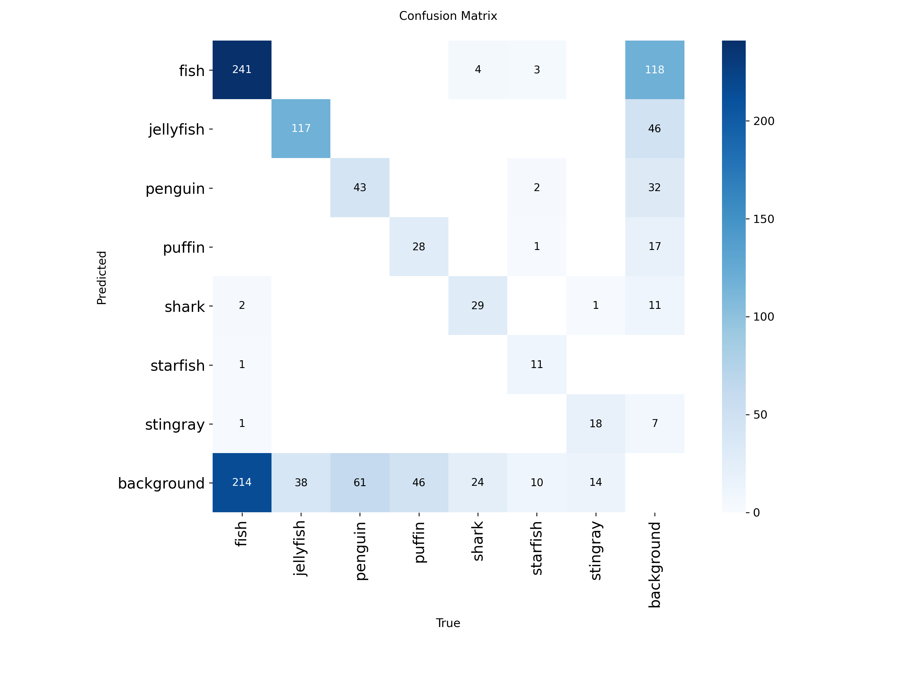
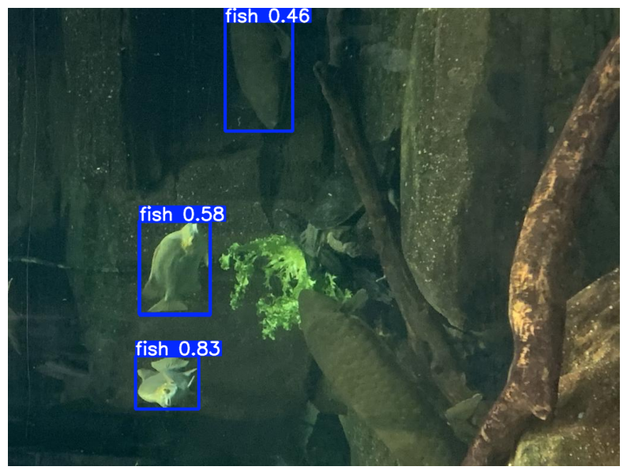

#  Underwater Object Detection with YOLO26

This project focuses on detecting and localizing marine life (fish, jellyfish, starfish, etc.) in underwater environments using the **YOLO26-nano** architecture.

# Project Overview
* **Architecture:** YOLO26-nano (Ultralytics)
* **Dataset:** UODD (Underwater Object Detection Dataset)
* **Objective:** Identifying marine species with high precision and real-time inference speed.
* **Environment:** Google Colab (Tesla T4 GPU)

# Model Performance
* **mAP50:** 58.8%
* **Detection Confidence:** Up to **83%** for fish in camouflaged backgrounds.
* **Inference Speed:** ~13ms per image.

# Confusion Matrix


##  Repository Contents
* `UnderwaterObjectDetection.ipynb`: Full source code for training and evaluation.
* `best.pt`: The trained model weights (ready for inference).
* `UODDexample.png`: Sample detection output from the test set.

##  Sample Prediction

```python
from ultralytics import YOLO

model = YOLO('best.pt')
results = model.predict(source='your_test_image.jpg', conf=0.25, save=True)
```
## 📊 Sample Output

> **Note on Model Limitations:** As seen in the sample output, the model successfully detects most targets but may struggle with highly camouflaged objects
(like the fish at the bottom center). This is a known challenge in underwater computer vision due to low contrast and background blending.
Future improvements could include data augmentation specifically for camouflaged environments.
